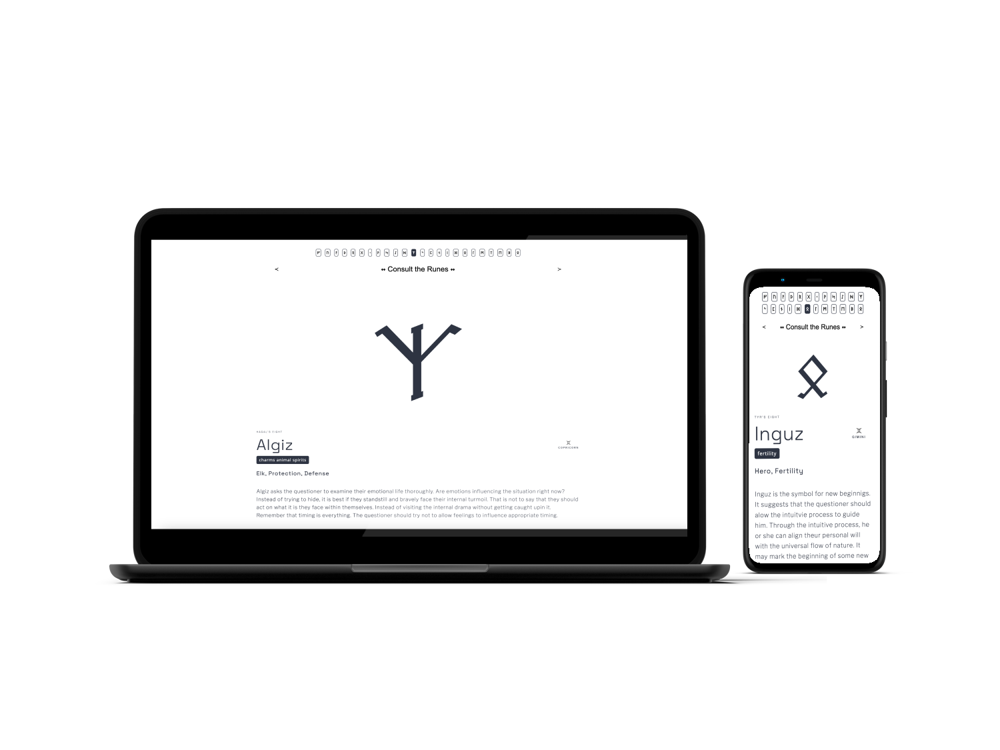

# Runes Oracle – Experimental Web App

This is a self-initiated experimental project inspired by ancient runes – mystical symbols believed to originate from pre-Christian European regions, particularly around the Bronze Age in areas like Germany and Scandinavia. Historically, these symbols were used for rituals, divination, and to channel the power of the gods according to pagan beliefs.

This project was fully designed and developed by me as an exploration of creative front-end development.

## 🌿 Project Concept
The app simulates the traditional rune-drawing experience: the user asks a question and draws a rune at random, just like casting rune stones. It is designed as a single-page application where one can click the **"Try Your Luck"** button to receive a randomly chosen rune and its interpretation.

In addition to the random rune feature, the app also includes a navigation bar with access to all runes. Users can browse them manually, learn about their symbolic meanings, and reflect on how each rune might relate to their life or their question.

## 🧩 Key Features
- Built with **React.js** (SPA structure)
- Random rune generation with smooth state updates
- Full navigation of all runes
- Responsive layout for mobile and desktop
- Clean UI with basic layout and typography choices

## 🎨 Design
I designed the interface layout, typography, and color palette with a minimalistic approach to keep the focus on the meaning and symbolism of the runes.

## 📁 Tech Stack
- **React** for UI rendering and component structure
- **React Hooks** (`useState`) for state management
- CSS for styling (custom responsive layout)
- Hosted on **Netlify**
- Version control via **Git & GitHub**

---
This app is not a scholarly source but an artistic and interactive homage to the symbolic system of runes.

Feel free to explore the code, suggest improvements, or use the concept as inspiration for your own interpretive interfaces.
